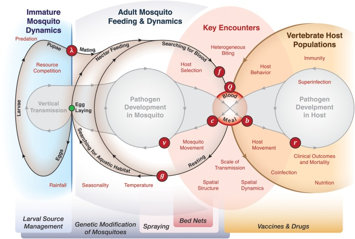
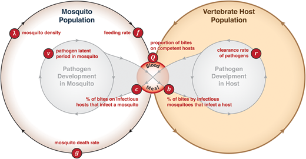
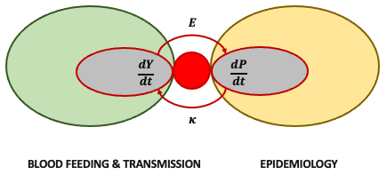
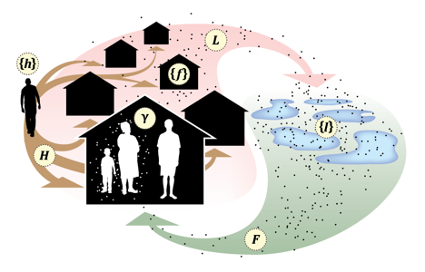

```{r, include = FALSE}
knitr::opts_chunk$set(
  collapse = TRUE,
  comment = "#>"
)
```

```{r setup}
library(MicroMoB)
```

# A Framework

## 0. Intro

This document describes a software package to build and run **microsimulation** models of mosquito-borne pathogens, called **Micro-MoB** (**Micro**simulation - **Mo**squito **B**orne). 

**NOTE** If you are viewing this document as `MicroMoB.html` in a web browser, you should see a set of nested tabs that will help you navigate this document. If you don't see the tabs, or if equations are rendered poorly, or if images are missing, please do the following: 

1. Save the file `MicroMoB.html` to a location on your desktop. 

2. Open `MicroMoB.html` from your web browser. 

3. If that doesn't fix the problems, please make a note of your configuration and send a note to David L Smith (smitdave@uw.edu) or (if it's active) send mail by clicking on [David L Smith](mailto:smitdave@uw.edu)

## 1. Intro

### 1.1 Why **Micro-MoB**?

There are already several software packages out there, but I wanted a package that was modular and flexible. 

+ Modularity 

+ Flexibility 

+ Scalability

+ Spatially explicit, localized effects


### 1.2 Modularity

**Micro-MoB** has a modular design. In the following, I introduce one version of the Ross-Macdonald model, then take it apart, modularize it, and re-assemble it as a generalized set equations that are very modular. 

#### 1.2.1  

Mosquito-transmitted pathogen models are naturally modular.  The simple models developed by Ross and Macdonald have given way, over time, to a very complicated set of concepts. 

```{r, echo=FALSE, fig.cap="The modular design of Micro-MoB.", out.width = "100%", fig.align='center'}

```


#### 1.2.2 Ross-Macdonald

##### 1.2.2.1 Transmission Dynamics 

*******  

```{r, echo=FALSE, fig.cap="A graphical representation of the Ross-Macdonald Model, from Smith DL, *et al.* (2014). For a longer introduction to the Ross-Macdonald model, see Smith DL, *et al.* (2012).", out.width = "100%", fig.align='center'}

```

*******  

The Ross-Macdonald model looks like this (Figure 2). It's a comparatively simple mathematical model that was formulated by Ronald Ross in 1911 as a system of coupled ordinary differential equations. The parameter names and the modern understanding is due largely to Macdonald from a set of papers published over the years 1950-1955. 


******* 

```{r, echo=FALSE, fig.cap="A graphical representation of the Ross-Macdonald model in Micro-MoB.", out.width = "100%", fig.align='center'}

```

*******  

In Micro-MoB, we've abstracted and expanded on the model to make it modular and easy to extend. To motivate why and how, I will rewrite one version of the Ross-Macdonald model. 

*******  

**References** 

+ Smith, D. L., Perkins, T. A., Reiner, R. C., Jr, Barker, C. M., Niu, T., Chaves, L. F., Ellis, A. M., George, D. B., Le Menach, A., Pulliam, J. R. C., Bisanzio, D., Buckee, C., Chiyaka, C., Cummings, D. A. T., Garcia, A. J., Gatton, M. L., Gething, P. W., Hartley, D. M., Johnston, G., … Scott, T. W. (2014). Recasting the theory of mosquito-borne pathogen transmission dynamics and control. Transactions of the Royal Society of Tropical Medicine and Hygiene, 108(4), 185–197.

+ Smith, D. L., Battle, K. E., Hay, S. I., Barker, C. M., Scott, T. W., & McKenzie, F. E. (2012). Ross, Macdonald, and a theory for the dynamics and control of mosquito-transmitted pathogens. PLoS Pathogens, 8(4), e1002588.

##### 1.2.2.1 A Ross-Macdonald-style Model 

This is one version of the Ross-Macdonald model can be written in the following way as a set of variables, parameters, and equations. I've written it as a set of coupled delay differential equations where $Y_\tau$ is interpreted as $Y(t-\tau)$. 

**Variables**

+ $M$ :: Mosquito Population Density 

+ $Y$ :: Infected Mosquitoes

+ $Z$ :: Infective mosquitoes

+ $H$ :: Human Population Density

+ $P$ :: Density of Infected and Infective Humans

**Parameters**

+ $\Lambda$ :: The emergence rate of adult, female mosquitoes

+ $\tau$ :: The extrinsic incubation period (EIP) 

+ $g$  :: The per-capita daily mosquito death rate

+ $f$ :: The per-capita daily mosquito blood feeding rate 

+ $Q$ :: The proportion of bloodmeals taken on a human 

+ $b$ :: The proportion of infective bites that infect a human 

+ $c$ :: The proportion of bites on infective humans that infect a mosquito 

**Equations**
\begin{equation}
\begin{array}{rl}
\frac{dM}{dt}&= \Lambda - g M \\ 
\frac{dY}{dt}&= fQc\frac{P}{H}(M-Y) - g Y \\ 
\frac{dZ}{dt}&= fQc\frac{P_\tau}{H_\tau}(M_\tau-Y_\tau) e^{-g\tau} - g Z \\ 
\frac{dP}{dt}&= bfQ\frac{Z}{H}(H-P) - r P \\ 
\end{array}
\end{equation}

##### 1.1.2.2. Decoupling 

With a couple of simplifications, I've rewritten the equations from 1.2.2.1 as a set of 3 coupled ODEs. 

\begin{equation}
\begin{array}{rl|rl}
\frac{dM}{dt}&= \Lambda - g M  \\ 
\frac{dY}{dt}&= fQ\kappa (M-Y) - g Y & \kappa &= c\frac{P}{H}\\ 
\frac{dP}{dt}&= bE (H-P) - r P & E &= fQ\frac{Y_\tau}{H} e^{-g\tau} \\ 
\end{array}
\end{equation}


#### 1.2.3 Mosquito Population Dynamics

Now, I want to extend the Ross-Macdonald model to consider mosquito population dynamics. 

******

```{r, echo=FALSE, fig.cap="The population dynamics of mosquitoes in a diagram.", out.width = "100%", fig.align='center'}
knitr::include_graphics("MosquitoEcology.png")
```

******


Instead of passing adult mosquito emergence rates, $\Lambda$, to the model as a trace function, I will instead let $\Lambda$ be a term that is passed from a new equation. 

**Variables** 

+ $L$ is the population density of immature mosquitoes in an aquatic habitat. 

**Parameters** 

+ $\nu$ is the number of female eggs laid, per blood meal 

+ $\theta$ is the development rate of immature mosquitoes 

+ $\gamma$ is the death rate of immature mosquitoes 

+ $\sigma L$ is the response to crowding, the increase in the per-capita death rate as a function of the density of immature mosquitoes 

**Terms** 

+ Let $G = f\nu M$ denote the number of eggs laid. 

+ Let $\Lambda = \theta L$ be the rate of emergence of adult mosquitoes. 

**Equations** 

\begin{equation}
\begin{array}{rl|rl}
\frac{dL}{dt} &= G - (\theta + \gamma + \sigma L) L & G &= v\nu M\\ 
\frac{dM}{dt} &= \Lambda - g M & \Lambda &= \theta L \\
\end{array}
\end{equation}

**Refs**

Brady, O. J., Godfray, H. C. J., Tatem, A. J., Gething, P. W., Cohen, J. M., McKenzie, F. E., Alex Perkins, T., Reiner, R. C., Jr, Tusting, L. S., Scott, T. W., Lindsay, S. W., Hay, S. I., & Smith, D. L. (2015). Adult vector control, mosquito ecology and malaria transmission. International Health, 7(2), 121–129.

Smith, D. L., Perkins, T. A., Tusting, L. S., Scott, T. W., & Lindsay, S. W. (2013). Mosquito population regulation and larval source management in heterogeneous environments. PloS One, 8(8), e71247.

#### 1.2.4 Modularized Equations


```{r, echo=FALSE, out.width = "100%", fig.align='center'}
knitr::include_graphics("Dynamics.png")
```

***** 

+ $dL/dt$ describes aquatic mosquito population dynamics

+ $dM/dt$ describes adult mosquito population dynamics

+ $dY/dt$ describes adult mosquito infection dynamics

+ $dP/dt$ describes host infection dynamics

\begin{equation}
\begin{array}{rl|rl}
\frac{dL}{dt} &= F_L(G,L) & G &= F_G(M) \\ \\ 
\frac{dM}{dt} &= F_M(\Lambda,M) & \Lambda &= F_\Lambda(L) \\ \\
\frac{dY}{dt} &= F_Y(M,Y,\kappa) & \kappa &= F_\kappa(P) \\ \\
\frac{dP}{dt} &= F_P(P,E,H) & E &= F_E(Y) \\ \\
\frac{dH}{dt} &= F_H(P,H) &   \\ \\
\end{array}
\end{equation}


### 1.3 Spatial Dynamics

We implement spatial dynamics in a micro-simulation framework. By _microsimulation_, we mean specifically that the models are designed to simulate pathogen transmission on point sets (See Figure 1). We developed these models to address a family of problems that are intrinsically spatial, and we needed software that was capable of handling the spatial complexity. The software has been designed to support **adaptive vector control**, and the software was designed to be fully modular. 

#### Figure 1 

The yellow circles in the figure identify most of the components of a micro-simulation model. A landscape is defined by a set of locations. Figure ` identifies two kinds of points: haunts where blood feeding occurs, $\left\{f\right\}$, and habitats where mosquitoes lay eggs, $\left\{l\right\}$. Mosquitoes move to find haunts and blood feed, $F$, or to find habitats and lay eggs, $L$. There is a set of human populations or humans, $\left\{h\right\}$, that spend some time at the huants, $H$. Mosquitoes find humans (or perhaps other vertebrate hosts) and take a blood meal, $\gamma$.

```{r, echo=FALSE, fig.cap="A framework for microsimulation on point sets (from Perkins, _et al._, 2013)", out.width = "100%", fig.align='center'}

```

#### Components

This software package is a framework for making microsimulation models for mosquito-borne pathogens. The elements of Figure 1 are formalized in a set of modular code that defines specific ways for these models to interact. It is thus possible to define and run micro-simulation models. The elements of the model are: 

+ A **Landscape** is usually defined by two point sets: 

    - A set of *haunts*, where mosquitoes rest and where blood feeding occurs, $\left\{ f \right\}$.

    - A set of *aquatic habitats* where mosquitoes lay eggs, $\left\{ l \right\}$; 

+ A set of **humans** $\left\{ h \right\}$ (or more generally, a set of a populations of the pathogen's hosts) is defined, either as individuals or as a set of sub-populations.
    
    - A model for the infection dynamics, or more generally the **epidemiology**.
    
    - A model ($H$) for how humans and other vertebrate hosts spend time the haunts, which is formalized into an object describing `TimeSpent`.  
    
+ We define **pathogen** population dynamics in the humans, including: 

    - A library of models for simulation _Plasmodium falciparum_ infection and immunity. 
    
    - A library of models for simulation West Nile Virus is also being developed. 
    
+ We define **mosquito** populations, including: 

    - Models describe the blood feeding behavior, population dynamics, and infection dynamics of pathogens in **Adult Mosquito** populations. Determinist and stochastic variants of several model families are defined in a model library. 
    
    - Models describe the population dynamics of **Aquatic Ecology** mosquito populations. Determinist and stochastic variants of several model families are defined in a model library.  

    - Each model for adult mosquito population dynamics must include functions describing adult mosquito dispersal as the result of a **search** to blood feed or lay eggs. 

    - Models of **Vector Control** have been developed to simulate the effectds of vector-based interventions in arbitrary detail. 

The core activity in this model is **Blood Feeding**. The software is modular, so that host movement and mosquito movement all work together to be sure there is a sensible way of describing blood feeding and pathogen **Transmission.**  The model for blood feeding uses the landscape: 

+ A function that translates `TimeSpent` by humans into time at risk (or `TaR`).  and biting among hosts at the haunts for each mosquito species, depending on their daily activity patterns. 

+ Other hosts may also be present. 
    
+ A function that computes _blood feeding success_ for mosquitoes and host choice as a function of host availability

+ Next, we compute the distribution of bites among hosts and output

    - The number of infective bites received by each host or host population
    
    - The probability a mosquito becomes infected after blood feeding
    

## 2. The Code

### 2.1 

The `Micro-MoB` project was created in the `R` language in the `RStudio` environment. 

The software is developed, maintained, and documented in a set of `.Rmd` files. This top level document, `Micro-MoB.Rmd`, which you might be viewing as `MicroMoB.pdf` or `MicroMoB.html`, gives an overview. 

The project is organized hierarchically, and the files have sensible names that indicate their position in the hierarchy, such as `Micro-Mosquito.Rmd` or `Micro-Mosquito-Adult.Rmd`. Model libraries, which define specific model families, have their `family` designation at the end of the filename, so `Micro-Mosquito-Adult-XX.Rmd` defines the adult mosquito model of the family `XX`. To avoid duplicating text and information, especially information that will need to be updated as the model libraries are extended, we will tend to push specific information into the appropriate lower level file. 

The structure of the hierarchy reflects the structure of a microsimulation model:  

+ `Micro-MoB.Rmd` (this file) contains some basic, high-level functions. 

+ `Micro-ModelObject.Rmd` describes the design of the model object in detail. 

+ `Micro-Landscape.Rmd` has utilities for constructing point-set landscapes and dispersal on point sets. 

+ `Micro-Human.Rmd` defines the function `HumanBehavior` and various functions.

    - `SpendTime()` is a core function describing human mobility. 
    
    - `Travel()` describes imported malaria, defined as exposure and infection outside of the landscape being simulated. 
    
    - `CareSeeking()` is a core concept that triggers treatment and sometimes other activities. 

+ `Micro-Mosquito.Rmd` is the high-level document for mosquito microsimulation. It defines the function `MosquitoDynamics()`. 

    - `Micro-Mosquito-Adult.Rmd` defines `dMdt()` and associated functions required to setup and simulate adult mosquito blood feeding behavior and infection dynamics. The model library for adult mosquitoes is the set of files `Micro-Mosquit-Adult-XX.Rmd` where `XX` is a moniker for the model family. 
    
    - `Micro-Mosquito-Aquatic.Rmd` defines `dLdt()` and defines various models for aquatic population dynamics. The model library for aquatic mosquitoes is the set of files `Micro-Mosquito-Aquatic-XX.Rmd` where `XX` is a moniker for the model family.
    
+ `Micro-VectorControl.Rmd` describes functions implement various modes of vector control, including:

    - `Micro-VectorControl-ITN.Rmd` defines several _ITN_ models, including ownership, usage, protection, and the effects on mosquito populations. 
    
    - `Micro-VectorControl-IRS.Rmd` defines several IRS models. 
    
    - `Micro-VectorContro-LSM.Rmd` deinfes larval source management.
   
+ `Micro-BloodFeeding.Rmd` has several functions required to model blood feeding, which is an interaction between vertebrate hosts and mosquitoes. 

    - Models for simulating the presence of alternative blood meal hosts. 
    
    - Models for simulating time at risk or `TaR` 
    
    - Models for simulating mosquito feeding success in relation to host availability, 
    
    

+ `Micro-Pathogen.Rmd` defines the function call for pathogen infection dynamics, `dPdt()`. The model library describing host infection dynamics is in the set of files `Micro-Pathogen-XX.Rmd` where `XX` is the moniker for the model family. 

    - `Micro-Pathogen-Pfalciparum.Rmd` is the base file for of *Plasmodium falciparum*
    
    - `Micro-Pathogen-Compartment.Rmd` has a set of generic compartment models. 

+ `Mirco-Visualize.Rmd` has utilities for visualization. 

### 2.2 purlAll 

All of the files written in `.Rmd` files output `R` code using `purl`. 

This function maintains a master list of all the document that define `MicroMoB`. Running `purlMicroMoB()` in `R` will remake all the `.R` files. To add new modules to the `MicroMoB` library, add them to this function. 

```{r purlMicroMoB}
purlMicroMoB= function(){ 
  
  require(knitr)

  # This file
  purl("Micro-MoB.Rmd", output = "Rcode/Micro.R", documentation = 0, quiet=TRUE)
  
  # Design and implementation of the model object 
  purl("Micro-ModelObject.Rmd", output = "Rcode/MicroModelObject.R", documentation = 0, quiet=TRUE)
  purl("Micro-IO.Rmd", output = "Rcode/MicroIO.R", documentation = 0, quiet=TRUE)
  
  # Landscape Utilities  
  purl("Micro-Landscape.Rmd", output = "Rcode/MicroLandscape.R", documentation = 0, quiet=TRUE)
  
  # Mosquito  
  purl("Micro-Mosquito.Rmd", output = "Rcode/MicroMosquito.R", documentation = 0, quiet=TRUE) 
  
  # Adult Mosquitoes
  purl("Micro-Mosquito-Adult.Rmd", output = "Rcode/MicroMosquitoAdult.R", documentation = 0, quiet=TRUE)
  
  # The Adult Mosquito Model Library 
  purl("Micro-Mosquito-Adult-RM.Rmd", output = "Rcode/MicroMosquitoAdultRM.R", documentation = 0, quiet=TRUE)
  purl("Micro-Mosquito-Adult-BQ.Rmd", output = "Rcode/MicroMosquitoAdultBQ.R", documentation = 0, quiet=TRUE)
  purl("Micro-Mosquito-Adult-BQa.Rmd", output = "Rcode/MicroMosquitoAdultBQa.R", documentation = 0, quiet=TRUE)
  purl("Micro-Mosquito-Adult-BQi.Rmd", output = "Rcode/MicroMosquitoAdultBQi.R", documentation = 0, quiet=TRUE)
  purl("Micro-Mosquito-Adult-BQS.Rmd", output = "Rcode/MicroMosquitoAdultBQS.R", documentation = 0, quiet=TRUE)
  
  # Aquatic Mosquitoes  
  purl("Micro-Mosquito-Aquatic.Rmd", output = "Rcode/MicroMosquitoAquatic.R", documentation = 0, quiet=TRUE)
  
  # The Aquatic Mosquito Model Library 
  purl("Micro-Mosquito-Aquatic-Trace.Rmd", output = "Rcode/MicroMosquitoAquaticTrace.R", documentation = 0, quiet=TRUE)
  purl("Micro-Mosquito-Aquatic-BH.Rmd", output = "Rcode/MicroMosquitoAquaticBH.R", documentation = 0, quiet=TRUE)
  purl("Micro-Mosquito-Aquatic-BC.Rmd", output = "Rcode/MicroMosquitoAquaticBC.R", documentation = 0, quiet=TRUE)
  purl("Micro-Mosquito-Aquatic-BCSS.Rmd", output = "Rcode/MicroMosquitoAquaticBCSS.R", documentation = 0, quiet=TRUE)
  purl("Micro-Mosquito-Aquatic-RBC.Rmd", output = "Rcode/MicroMosquitoAquaticRBC.R", documentation = 0, quiet=TRUE)
  
  # The Vector Control Library 
  purl("Micro-VectorControl.Rmd", output = "Rcode/MicroVectorControl.R", documentation = 0, quiet=TRUE) 
  purl("Micro-VectorControl-ITN.Rmd", output = "Rcode/MicroVectorControlITN.R", documentation = 0, quiet=TRUE) 
  purl("Micro-VectorControl-IRS.Rmd", output = "Rcode/MicroVectorControlIRS.R", documentation = 0, quiet=TRUE) 
  
  # Human 
  purl("Micro-Human.Rmd", output = "Rcode/MicroHuman.R", documentation=0, quiet=TRUE)
 
  # Blood Feeding 
  purl("Micro-BloodFeeding.Rmd", output = "Rcode/MicroBloodFeeding.R", documentation=0, quiet=TRUE)
  
  # Pathogen 
  purl("Micro-Pathogen.Rmd", output = "Rcode/MicroPathogen.R", documentation = 0, quiet=TRUE)
  
  # P. falciparum
  purl("Micro-Pathogen-PfSI.Rmd", output = "Rcode/Micro-PfSI.R",  documentation = 0, quiet=TRUE) -> tmp
  purl("Micro-Pathogen-PfEZAoY.Rmd", output = "Rcode/MicroPfezAoY.R", documentation = 0, quiet=TRUE)
  
  # Compartment
  purl("Micro-Pathogen-SIR.Rmd", output = "Rcode/MicroSIR.R", documentation = 0, quiet=TRUE)
  
  purl("Micro-Intervene.Rmd", output = "Rcode/MicroIntervene.R",  documentation = 0, quiet=TRUE) -> tmp
  purl("Micro-Intervene-RCD.Rmd", output = "Rcode/MicroInterveneRCD.R",  documentation = 0, quiet=TRUE) -> tmp
  
  # Visualization
  purl("Micro-Visualization.Rmd", output = "Rcode/MicroVisualization.R", documentation = 0, quiet=TRUE)
 
  
  print("Done with purlMicroMoB(). Run refreshMoB() to remake MicroMoB.R from *.R files in ./Rcode/")
}
```

### MicroMoB.R

The following code runs `purlMicroMoB.R` and contatenates all the `.R` files into a single file, `MicroMoB.R`. 

```{r refreshMoB defined, eval=F}
refreshMoB = function(){ 
  # Defined in Micro-MoB
  # Defined in Micro-MoB
  system("rm *.R")
  system("rm Rcode/*.R")
  purlMicroMoB()
  system("cat Rcode/*.R > MicroMoB.R")
  print("MicroMoB.R has been remade.")
}

remob = function(){
  # Defined in Micro-MoB
  refreshMoB()
  source ("MicroMoB.R")
  print("sourced MicroMoB.R")
}
```

To be sure this file works, we source the `R` code: 
```{r, purl=F, eval=FALSE}
source ("MicroMoB.R")
```

If it did not work, when we would need to run `purlMicroMoB()`, remake `MicroMoB.R` and then source it. (We do not run `purlMicroMob()` by default because it would create a loop). If something goes wrong, run this block: 

```{r, purl=F, eval=F}
remob() 
```


## 3. Design

### 3.1 

To implement a modular **microsimulation** framework, we designed code that was flexible and extensible. To facilitate model building, we designed utilities to help users set up models, modify the models, calibrate the models, and visualize the outputs. 

### 3.2 Setting up a Model 

Simulation in `Micro-MoB` has a fixed structure.  


### 3.3 Simulation

#### 3.3.1 `MicroSim` and `MosquitoMicroSim` 

Simulations are designed for a purpose. Here, we have defined two core pieces of: 

+ `dMicroSim` runs one time step of a Microsimulation model with all its components.

+ `dMosquitoMicroSim` runs one time step of a microsimulation with only mosquitoes. Inputs from the humans are passed as a trace function.  


```{r MicroSimulation}
MicroSimulation = function(Model){with(Model$runtime,{
  # Defined in Micro-MoB
  for(t in T0:Tmax){
    if (t %% 100 == 0) print(paste("t =", t)) 
    Model = dMicroSim(t, Model)
    Model = IO(t, Model)
    Model = Update(t, Model)
  } 
  return(Model)
})}
```

```{r MosquitoMicroSim}
MosquitoMicroSim = function(Model){with(Model$runtime,{
  # Defined in Micro-MoB
  for(t in T0:Tmax){
    print(c(t=t))
    Model = dMosquitoMicroSim(t, Model)
    Model = IO(t, Model)
  } 
  return(Model)
})}
```

#### 3.3.2 `dMicroSim` and `dMosquitoMicroSim`

```{r dMicroSim}
dMicroSim = function(t, Mod){
  # Defined in Micro-MoB
  ##########################################
  # + IRS Spraying
  # + ITN Mass Distribution
  # ... and other modes of vector control
  # + Mass Treatment
  # + Reactive Case Detection
  # ... and other health-based interventions
  ##########################################
  Mod = Intervene(t, Mod)
  
  ##########################################
  #  Called by: 
  #    + some models of aquatic mosquito
  #      populations with dynamic resources 
  #      & resource-based competition. 
  #########################################
  #Mod = Update(t, Mod)  

  ###########################
  # Micro-Human.Rmd 
  # + TimeSpent
  # + MyITN, UseITN
  ###########################
  Mod = HumanBehavior(t, Mod)

  ###########################
  # VectorControl.Rmd 
  # + ITNs, IRS, LSM
  ###########################
  Mod = VectorControlEffects(t, Mod)

  #######################
  # Micro-BloodFeeding.Rmd
  # + FeedingSuccess modifies MPars$psi
  # + kappa, eir, Q
  #######################
  Mod = BloodFeeding(t, Mod)
  
  ##############################
  # Micro-Mosquito.Rmd
  # Micro-Mosquito-Adult.Rmd
  # Micro-Mosquito-Aquatic.Rmd
  # + dMdt
  # + dLdt
  ##############################
  Mod = MosquitoDynamics(t, Mod) 

  ###############################
  # HumanMicro.Rmd
  # + P.falciparum
  ###############################
  Mod = InfectionDynamics(t, Mod)
  
  return(Mod) 
}
```

```{r dMosquitoMicroSim}
dMosquitoMicroSim = function(t, Mod){
  # Defined in Micro-MoB
  ###########################
  # VectorControl.Rmd 
  # + ITNs, IRS, LSM
  ###########################
  Mod = VectorControl(t, Mod)

  #######################
  # BloodFeeding.Rmd 
  # + Feeding Success
  # + kappa, passed as a trace
  # + eir
  #######################
  Mod = BloodFeeding(t, Mod)
  
  ##############################
  # MosquitoMicrosimulation.Rmd
  # + dMdt
  # + dLdt
  ##############################
  Mod = MosquitoDynamics(t, Mod) 
  
  return(Mod) 
}
```

#### 3.3.3 Pseudocode 

This pseudocode describes 'dMicroSim'. It is possible to run only a subset of these algorithms, passing the required arguments as traces. 

**Human Behavior**

Human behaviors relevant for malaria dynamics and control come first. 

+ _Time Spent_: To model blood feeding, we first determine the location of humans when they are not traveling. An algorithm generates an object called `TimeSpent.`

+ _Travel_: To model imported malaria, we need to simulate travel outside of the area. 

+ _MyITN_: Dynamics of ITN ownership, including ITN damage, replacement and loss.

+ _UseITN_: Human use of ITNs affects mosquito blood feeding behaviors. This function models ITN usage. 

+ _SeekCare_: Care seeking is simulated explicitly in some simulations, which allows humans to show up at a clinic. 

+ ... 

**Vector Control** 

How is transmission by mosquitoes modified by control? 

+ _Baseline_:

    - To set up vector control for any given day, we need to reset `MPars` to `MBase` and `LPars` to `LBase`. 
      
    - The following algorithms modify `MPars` and `LPars` to reflect modifications to mosquito feeding success and survival affected by vector control. 

+ _ITN_ 

    - ITN ownership and usage are human behaviors. They are managed by _MyITN_ and _UseITN_, which set up the ITN model.  

    - ITN use increases contact with the net, which reduces daily mosquito survival in `MPars`
    
    - ITN use modifies human biting weights to reduce blood feeding success. 

    - (OPT) In `MPars`, modify seach weights and mosquito search in `PsiBB` and `PsiQB` 

+ _IRS_

    - _IRS_ modifies mosquito survival at sprayed haunts in `MPars`

    - (OPT) _IRS_ could also modify mosquito search, affecting `PsiBB` and `PsiQB` 

+ _LSM_

    - Modify `LPars`

    - (OPT) In `MPars`, modify seach weights and mosquito search in `PsiBB` and `PsiQB` 

**Blood Feeding** 

For each mosquito species (or population): 

+ Derive `TaR` from `TimeSpent` 

+ Derive `SiG` from `TaR` + human population density + search weights (`SiG` = Skin in the Game)

+ Derive `DiB` from `SiG` (`DiB` is distributed bites) 

+ Compute _Feeding Success_ and set `psiB` 

+ Compute and store

    - `eir`
    
    - `kappa`
    
    - `Q`

**Mosquito Dynamics** 

+ Run adult mosquito population dynamics (requires `kappa`)

+ Run aquatic mosquito population dynamics 

**Infection Dynamics** 

+ Run the infection dynamics (requires 'eir')


The following sections show how to setup and 


##### MosquitoMicroSim 


## 4. Demo

```{r, fig.height=5, fig.width=5, purl=F, eval=FALSE}
model = makeModel.demo() 
#plotPoints(model$landscape)
#plotKernels(model$landscape, model$mosquito[[1]])
#NullModel = addSample(NullModel, "rmpr")
#nm1 = HumanBehavior(0, NullModel)
#nm2 = VectorControl(0, nm1)
#nm3 = BloodFeeding(0, nm2)
#nm4 = MosquitoDynamics(0, nm3)
#nm5 = InfectionDynamics(0, nm4)
#nm6 = Sample(0, nm5, 1)
#nm7 = Sample(0, nm6, 2)
#NM0 = dMicroSim(0, NullModel)
#NM1 = Sampling(0, NM0)
#NM2 = dMicroSim(1,NM1)
#NullModel = MicroSim(NullModel)
```


## 5. Model Building

This software has been designed 

### .

### Landscapes

#### .

To run a microsimulation, it is necessary to create a `Model Object`:

+ Utilities to set up the **landscape** are described in `PointSets.Rmd.` Relevant functions can be sourced from `PointSets.R`. 

+ Utilities to set up mosquito dispersal kernels are in `MosquitoDispersal.Rmd.` Relevant functions can be sourced from `Kernels.R`. 

### Humans

#### Behaviors 

+ Models for time at risk are defined in `TaR.Rmd`, and relevant functions are sourced in `TaR.R`. 

#### Infection Dynamics

+ Models for infection, given exposure, are defined in `Malaria.Rmd,` and relevant functions are sourced in `Malaria.R`


### Blood Feeding

### Mosquitoes

+ Mosquito microsimulation is set up in `MosquitoMicrosimulation.Rmd`. Relevant functions can be sourced from `MosquitoMicrosimulation.R`. The two components of microsimulation are setup in separate files:

    - Models for adult mosquito population dynamics are described in `AdultMicroecology.Rmd`, and relevant functions can be sourced from `AdultMicroecology.R`

    - Models for aquatic population dynamics are defined in `AquaticDynamics.Rmd`, and relevant functions can be sourced from `Aquatic.R`.


+ Transmission is described in `loodMeal.Rmd` and relevant functions are sourced in `bloodmeal.R`


### Vector Control


#### Mosquito Microsimulation

Mosquito microsimulation can be run independently (see `MosquitoMicrosimulation.Rmd`). 


## 6. Analytics

### .

### Version Control

### Calibration

### Visualization

Write me. 


## References 

+ Perkins TA, _et al._, (2013). Heterogeneity, mixing, and the spatial scales of mosquito-borne pathogen transmission. PLoS Computational Biology, 9(12), e1003327.

+ Smith DL, _et al._, (2014). Recasting the theory of mosquito-borne pathogen transmission dynamics and control. Transactions of the Royal Society of Tropical Medicine and Hygiene, 108(4), 185–197.
