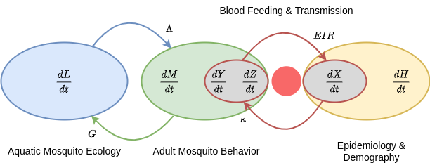
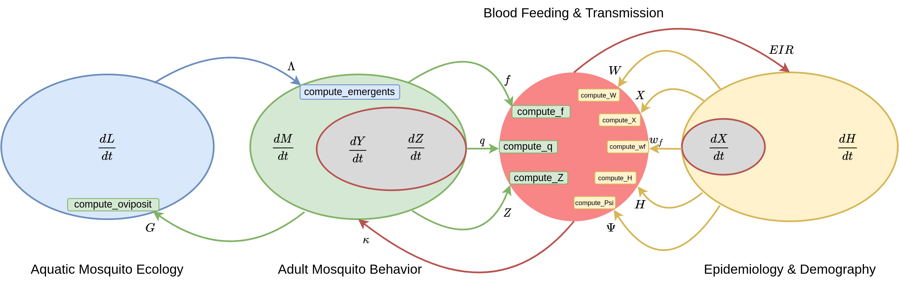

```{r, include = FALSE}
knitr::opts_chunk$set(
  collapse = TRUE,
  comment = "#>"
)
```

## Introduction

**Micro-MoB** is a software package which implements a framework for building mathematical models of
mosquito-borne pathogen transmission (MBPT). The framework is flexible enough to incorporate vastly different
models while at the same time places constraints upon how parts of the framework interact so that the software does not become obfuscatingly complex each time a new feature must be added.

We define terms used to talk about **Micro-MoB** below:

  * **components**: these are the irreducible "parts" of MBPT models, and must be implemented in any model built
  in **Micro-MoB**, even if only as a trivial model (e.g. as a constant value or external forcing term). The components
  are adult mosquitoes, immature (aquatic) mosquitoes, resident (modeled) humans, non-resident visitors, and other blood hosts
  (e.g. livestock).
  * **interface**: each component defines an interface, which other components and invariants (functions) can use to query
  information about it. The interface defines what a component is expected to compute and expose to the rest of the system.
  * **model**: a specific instantiation of a component, which necessarily fulfills that component's interface. The SIS (Susceptible-Infectious-Susceptible) model for human dynamics is a model for the human component, for example.
  * **invariant**: any computation which is generic across any specific set of models and which uses the generic interface
  to query state and compute values which may be returned to components. The bloodmeal algorithm is an example, and the code
  is a contract with the modeller meaning any model fulfilling the component interface it fills will be able to interact
  with the rest of the framework, and the existing set of models. It is described in `vignette("bloodmeal")`.

### Software design

To accomplish this component-interface design in R, we use the [S3 object system](http://adv-r.had.co.nz/S3.html).
Each component is a named element in the model object (an environment). The interface
defines a set of generic functions which dispatch on the specific class of the object
taking the place of that component.

### Dynamics

A simplified schematic of the relationships between components (i.e. the model's _dynamics_) in
**Micro-MoB** is shown below.

```{r echo=FALSE, out.width='100%'}

```

The aquatic (immature) mosquito component $L$ is in blue. Over a time step, it takes in eggs laid by
ovipositing adult mosquitoes $G$, and updates state, producing newly emerging adults $\Lambda$.
These emerging mosquitoes are added to the adult mosquito component (green). In the adult component,
$M$ represents the total mosquito density, $Y$ and $Z$ are infected and infectious mosquito
populations, respectively. Uninfected mosquitoes become infected by biting infectious hosts,
and during blood feeding are infected with probability $\kappa$, computed by the bloodmeal (red).
Infectious mosquitoes take bites on human hosts, resulting in a human per-capita rate of
infection $EIR$, computed by the bloodmeal, which changes prevalence of disease, $X$. The
overall human component (yellow) has dynamics acting on $H$.

## Components

For each component, the interface is defined in a file, for example, `R/humans_interface.R`
shows the user what methods must be defined for any human model.

A specific implementation of a component is a model, and files that replace _\_interface_ with the
model name implement that model (e.g. `R/humans_SIS.R` implements a SIS model). 

We list the components which require interfaces below and specific models
to implement them.

### Mosquitoes

The mosquito component is responsible for all dynamics which update adult mosquito
populations. The interface is defined in `R/mosquito_interface.R`, and the interface
methods which are required to be implemented can be found [here](https://dd-harp.github.io/MicroMoB/reference/index.html#adult-mosquito-component).

### Aquatic

The aquatic component is responsible for all dynamics which update immature (aquatic
stage) mosquito populations. The interface is defined in `R/aquatic_interface.R`,
and the interface methods with are required to be implemented can be found [here](https://dd-harp.github.io/MicroMoB/reference/index.html#aquatic-immature-mosquito-component).

### Humans

The human component updates human populations. The interface is defined in `R/humans_interface.R`,
and the interface methods with are required to be implemented can be found [here](https://dd-harp.github.io/MicroMoB/reference/index.html#human-component).

### Visitor

The human component updates human populations outside of the resident population of the geographic area being simulated. 
The interface is defined in `R/visitor_interface.R`, and the interface methods with are required to be implemented can be found [here](https://dd-harp.github.io/MicroMoB/reference/index.html#visitor-component).

### Other blood hosts

The other (alternative) blood host component is responsible for other blood hosts for 
mosquitoes (livestock, dogs, etc). The interface is defined in `R/other_interface.R`,
and the interface methods with are required to be implemented can be found [here](https://dd-harp.github.io/MicroMoB/reference/index.html#alternative-blood-hosts-component).

## Dynamics between components

Now that we've seen the components and know where to find the interfaces, we can present
the dynamics again, but annotated with more information telling us exactly what methods
are used to pass information between components. For example, we see a green arrow sending eggs, $G$, 
from the adult mosquitoes to the aquatic mosquitoes component. Within the aquatic component (blue oval)
we see a green method, `compute_oviposit`, meaning that the aquatic component's state update
method can use this interface method to get the number of eggs laid each time step.

Please note we do not include the visitor or other blood host components in this diagram,
as they are supplied as external forcing (or constants) to the bloodmeal and do not carry state.

```{r echo=FALSE, out.width='100%'}

```

## Writing new models

To write a model for a component means that one must write methods that fulfill
each component's interface, and ensure that those methods return the correct
data structure. Information on the methods can be found in the function reference
under each component. In addition, a new model must have a setup function,
which takes in parameters, does argument checking, and attaches a new object with
the correct name and class attached to the model object returned from `make_MicroMoB()`.

For example, to make a new mosquito model, with class `MyModel`, one would need
to do the following:
  
  1. Write a function `setup_mosquito_MyModel` which attaches an object (usually a list)
  to the model environment with the `class` attribute assigned to `"MyModel"`.
  2. Write methods for the interface `compute_f.MyModel`, `compute_q.MyModel`,
  `compute_Z.MyModel`, and `compute_oviposit.MyModel`. Information on what each
  method is expected to compute and return can be found [here](https://dd-harp.github.io/MicroMoB/reference/index.html#adult-mosquito-component).
  3. Write a step (updating) function, `step_mosquitoes.MyModel`. One can optionally
  allow the `class` attribute of the model list to have 2 elements to allow for dispatching
  on stochastic or deterministic step updates, in which case one would additionally write
  `step_mosquitoes.MyModel_stochastic` and `step_mosquitoes.MyModel_deterministic`.
  Please look at the [source code](https://github.com/dd-harp/MicroMoB/blob/HEAD/R/mosquito_RM.R)
  of the Ross-Macdonald mosquito model to see how to do this.
  4. Write basic tests for your model, which go in `tests/testthat`. At a minimum,
  your tests should confirm that the model can be set up properly and produces
  correct results when updated over a time step.
