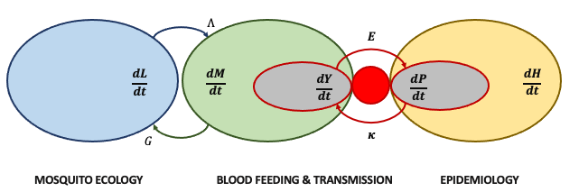

```{r, include = FALSE}
knitr::opts_chunk$set(
  collapse = TRUE,
  comment = "#>"
)
```

## Introduction

**Micro-MoB** is a software package which implements a framework for building mathematical models of
mosquito-borne pathogen transmission (MBPT). The framework is flexible enough to model real scenarios while at the same time places constraints upon how parts of the framework interact so that the software does not become obfuscatingly complex each time a new feature must be added. 

The framework defines **components** which have an **interface**. The components cover all parts of MBPT models: adult mosquitoes, immature (aquatic) mosquitoes,
resident humans, non-resident visitors, and other blood hosts. A specific instantation of a component is called a **model**.
For example, the Ross-Macdonald model of adult mosquito dynamics can fulfill the adult mosquito interface and thus fill that
component "box". Certain computations that involve the passing of information between components are **invariant**, such as the bloodmeal,
where a matrix is computed describing how bites from mosquitoes are distributed across hosts. These computations use the 
generic component interface, so any model fulfilling an interface can fit seamlessly into the existing set of models.

## Software design

To accomplish this component-interface design in R, we use the [S3 object system](http://adv-r.had.co.nz/S3.html).
Each component is a named element in the model object (an environment). The interface
defines a set of generic functions which dispatch on the specific class of the object
taking the place of that component.

## Components

```{r echo=FALSE, out.width='100%'}

```

The model is broken into components, for humans, immature and adult mosquitoes (and some others).
Each component has an _interface_, which are methods which must be defined for that
component. A component's interface is stored in file, for example, R/humans_interface.R
shows the user what methods must be defined for any human model. Other components (e.g. the bloodmeal)
will call generic methods not knowing what specific code is implementing them, and so
they must return values consistent with their definition.

We call a specific implementation of a component a _model_.
Specific implementations are found in files that replace _\_interface_ with the
model name, for example R/humans_SIR.R. Their accompanying test files are located in
tests/testthat. If you are creating a new model, please remember to test it
adequately.

We list the components which require interfaces below and specific models
to implement them.

### Mosquitoes

The mosquito component is responsible for all dynamics which update adult mosquito
populations. The interface is defined in `R/mosquito_interface.R`.

### Aquatic

The aquatic component is responsible for all dynamics which update immature (aquatic
stage) mosquito populations. The interface is defined in `R/aquatic_interface.R`.

### Humans

The human component updates human populations. The interface is defined in `R/humans_interface.R`.

### Visitor

The human component updates human populations outside of the resident population of the geographic area being simulated. 
The interface is defined in `R/visitor_interface.R`.

### Other blood hosts

The other (alternative) blood host component is responsible for other blood hosts for 
mosquitoes (livestock, dogs, etc). The interface is defined in `R/other_interface.R`.

## Invariants

### Bloodmeal

We describe how the bloodmeal algorithm works in a separate article, `vignette("bloodmeal")`
