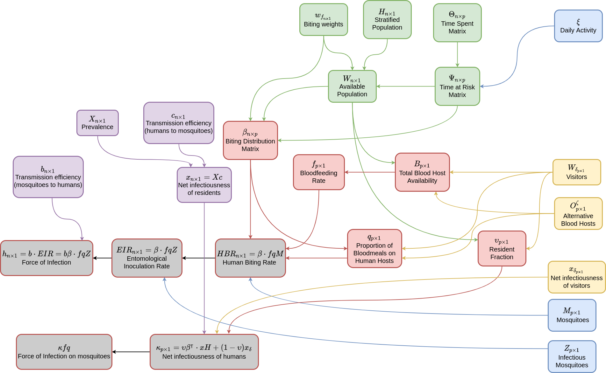
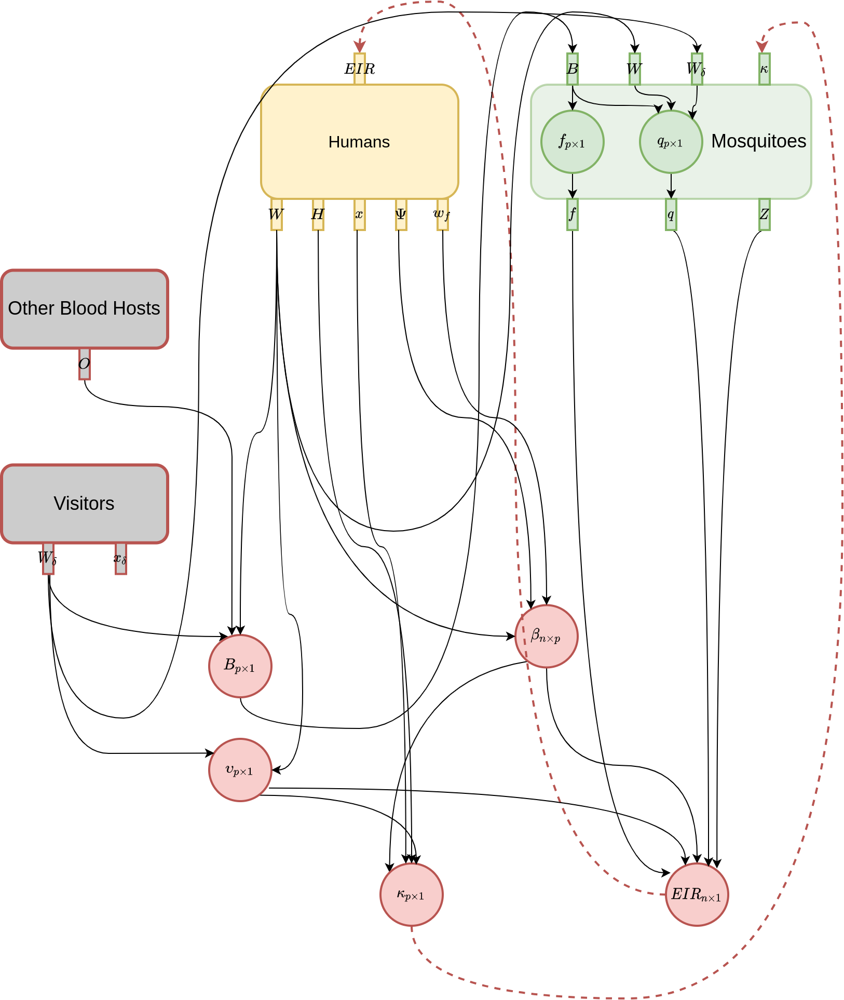

```{r, include = FALSE}
knitr::opts_chunk$set(
  collapse = TRUE,
  comment = "#>"
)
```

## Introduction

Blood feeding (when a adult female mosquito seeks out and feeds on a blood host) is a crucial
_invariant_ in **Micro-MoB**, and models of mosquito-borne pathogen transmission (MBPT) generally.
Blood feeding is an algorithm which uses information provided by the 
interface from each component to compute values which give the distribution of bites
from mosquitoes onto hosts, and the rate that mosquitoes feed. The blood feeding
function (`compute_bloodmeal()`) is in `R/bloodmeal.R`.

## Schematic

Below is a schematic describing visually the quantities that are generated in the blood meal algorithm.
Different colors refer to different components: green indicates values from the human component, blue indicates
values from the adult mosquito component, and yellow indicates values from the other blood hosts and visitor
components.

Values which are computed by the blood meal which are not directly involved with
transmission are in red, and values that are directly relevant for transmission are in grey.

```{r echo=FALSE, out.width='100%', eval=F}

```

The bloodmeal function updates several values within specific components. Those are:

  * $\kappa$: a vector of length `p`, giving the net infectiousness of hosts to mosquitoes in each patch (adult mosquito component).
  * $EIR$: a vector of length `n`, giving the entomological inoculation rate on hosts in each strata (human component).
  * $f$: a vector of length `p`, giving the blood feeding rate of mosquitoes in each patch (adult mosquito component).
  * $q$: a vector of length `p`, giving the proportion of blood meals taken on human hosts by mosquitoes in each patch (adult mosquito component).
  
After these values have been computed, each component's update (step) function
can use them to update infection in the population. These four values are the crucial
metrics that describe how mosquitoes feed upon hosts, and how pathogens are transferred
between infectious hosts to susceptible mosquitoes, and vice versa. For this reason we call
bloodfeeding an invariant component, meaning any full MBPT model will need to simulate this process. 

## Human component

Using the generic interface from the human component, the following values are calculated
which are used to compute biting and transmission.

  * `H`: from `compute_H`, gives the total population in each strata
  * `x`: from `compute_x`, gives the net infectiousness from humans in each strata
  * `wf`: from `compute_wf`, gives the biting weights of each strata
  * `Psi`: from `compute_Psi`, gives the time at risk matrix
  * `W`: gives the weighted person time at risk spent at each patch; please
  note `W` is calculated from the above values (rather than from a dispatching method)
  
## Mosquito component

Likewise, the following values are required from the mosquitoes.

  * `f`: from `compute_f`, gives the per-capita blood feeding rate in each patch
  * `q`: from `compute_q`, gives the human blood feeding proportion in each patch
  * `Z`: from `compute_Z`, gives the infectious mosquito density in each patch
  
## Other components

We also need to compute:

  * `Wd`: from `compute_Wd`, the biting availability of visitors in each patch
  * `O`: from `compute_O`, the biting availability of other blood hosts in each patch
  * `xd`: from `compute_xd`, the net infectiousness of visitors in each patch

## Biting distribution matrix ($\beta$)

$\beta$, the biting distribution matrix, is an `n` by `p` matrix which describes how bites
from mosquitoes in patches get distributed over human population strata. If it is multiplied 
on the right by a vector $fq \upsilon Z$ which gives the total number of bites on humans taken
by mosquitoes in each patch, the result is a length `n` vector giving the per-capita $EIR$.

\begin{equation}
\beta_{n\times p} = \mbox{diag}(w_{f}) \cdot \Psi \cdot \mbox{diag}(1/W) \\
\end{equation}

## Entomological inoculation rate ($EIR$)

The entomological inoculation rate is directly proportional to the force of infection in humans $h = EIR \cdot b$,
where $b$ is the transmission efficiency, the probability a bite from an infectious mosquito successfully
causes infection in a human host. It is simply computed as:

\begin{equation}
EIR_{n\times 1} = \beta \cdot fq\upsilon Z
\end{equation}

## Net infectiousness of the human population ($\kappa$)

The net infectiousness of humans is the probability that a mosquito would become infected
after biting a random human host. It's directly proportional the force of infection in mosquitoes,
which is $\kappa fq$. After being calculated and passed to the mosquitoes, any particular
mosquito model can use it to update state over a time step.

\begin{equation}
\kappa_{p\times 1} = \upsilon \cdot (\beta^{\top} \cdot xH) + (1 - \upsilon) x_{\delta}
\end{equation}

## Directed wiring diagram

Another way to view the bloodmeal computation is as a [directed wiring diagram (DWD)](https://www.algebraicjulia.org/blog/post/2021/01/machines/).
In this DWD there are two types of "boxes", rectangles and circles. Rectangles are elements of the model with state, similar to machines in automata theory. Circles represent functions which do not have internal state, but may take some number of inputs and produce
and output. Circles which are inside of a rectangle represent functions that "belong" to that rectangle.

Putting this back in terms of **Micro-MoB**, rectangles are components and circles are either _invariant_ functions
(if they live outside of a box), or are methods that dispatch depending on what model fills their component (if
they live inside of a box).

```{r echo=FALSE, out.width='100%', eval=F}

```
